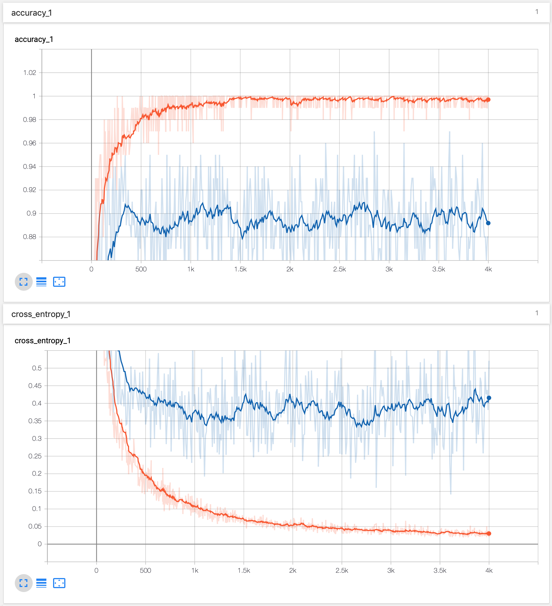
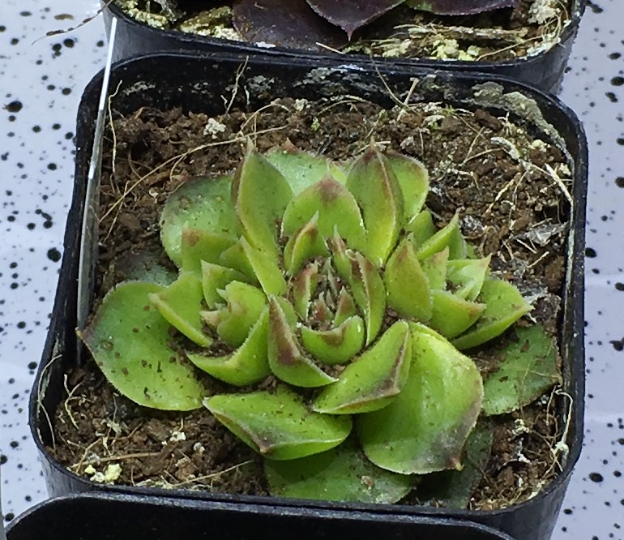
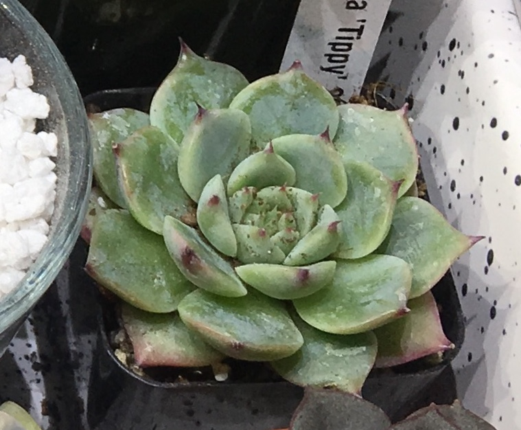
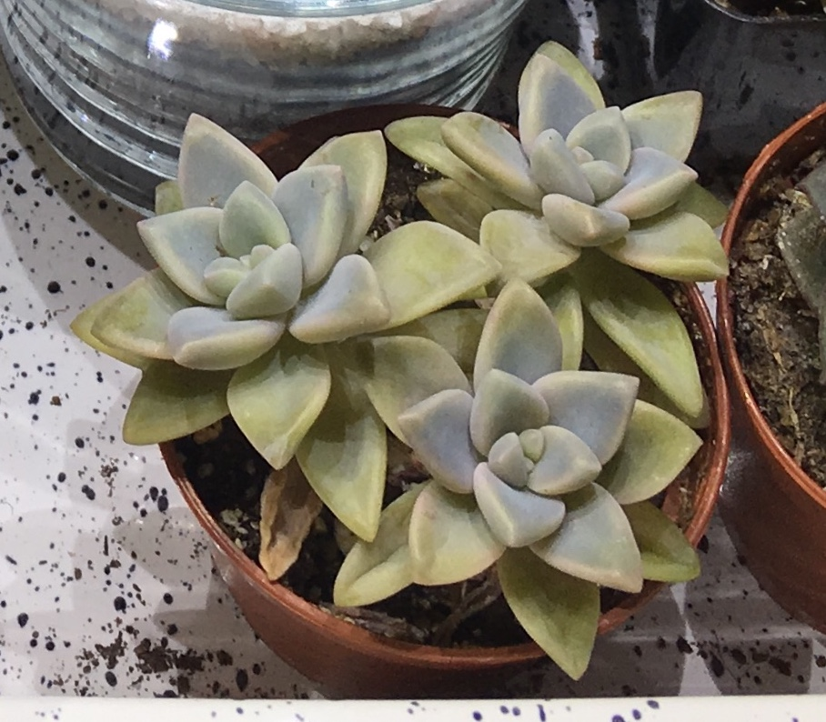
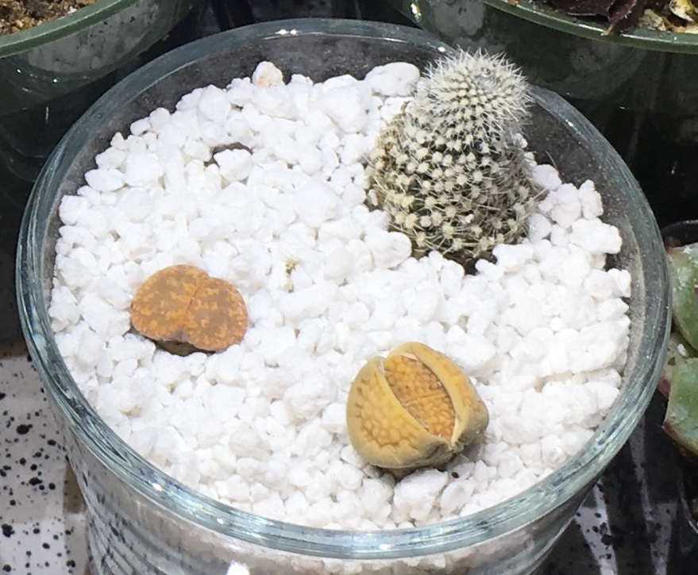
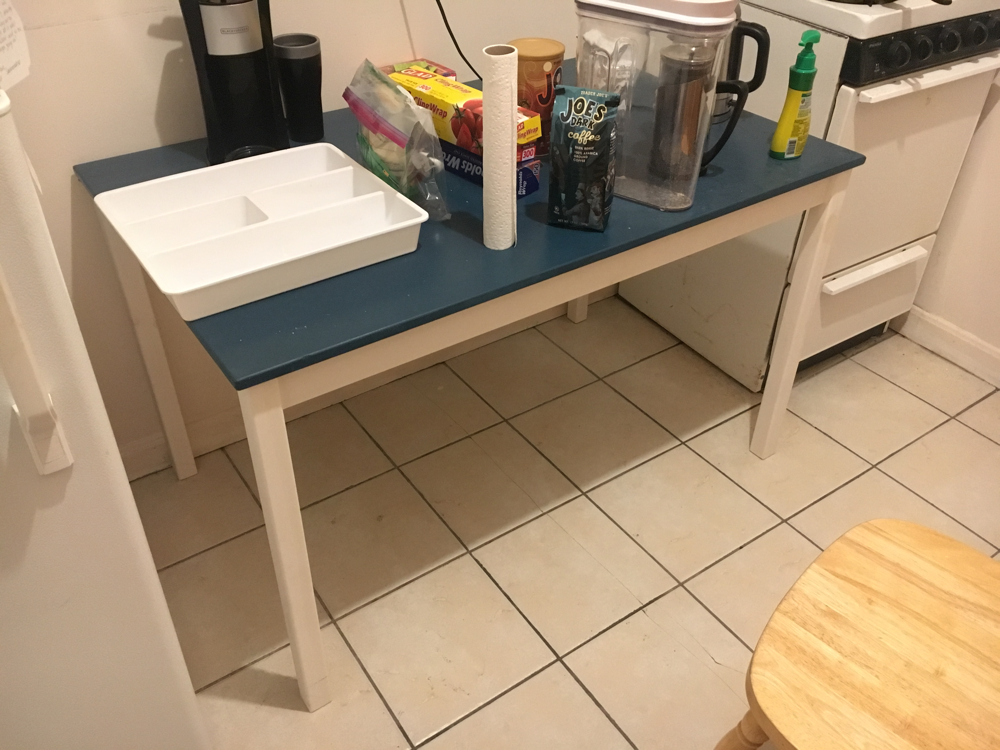

# Demo using CoreML


[](https://github.com/jhrcook)
[](https://twitter.com/JoshDoesa)
[](https://joshuacook.netlify.com)

This is a demonstration of using CoreML to recognize succulents from images. It is still very much in it's early stages.

**Overview**

1. Create an R script that scrapes the plant names from [World of Succulents](https://worldofsucculents.com/browse-succulents-scientific-name).
2. Create a shell script that uses [Google Images Download](https://github.com/hardikvasa/google-images-download) to download the images to a directory called "data/" and each plant has a subdirectory.
3. Use TransorFlow to retrain an image classifier with my new data set.
4. Use the `core-ml` python package to convert the TensorFlow model into one that can be imported into Xcode for CoreML


## Data

I scraped plant names from [World of Succulents](https://worldofsucculents.com/browse-succulents-scientific-name) using '[rvest](https://cran.r-project.org/web/packages/rvest/index.html)' to retrieve and parse the HTML. The code is in "make\_plant\_list.r" and outputs a list of names to "plant_names.txt" and a JSON called "download\_plant\_images.json". Then, "download\_google\_images.sh" downloads the first 100 images from a Google Images search using the [Google Images Download](https://github.com/hardikvasa/google-images-download) python library.

### Preparing JSON file for doanloading

The Rscript "make\_plant\_list.r" parses the plant names into "plant\_names.txt" and "download_plant_images.json". The maximum number of images I can download without Chrome installed is 100. Therefore, to keep everything on the O2 cluster, I will stick to that limit for the testing phase of this demonstration. Only 5 test plants are being used right now, chosen on the basis that I have unique images of these species (i.e. I own them).

```bash
Rscript make_plant_list.r
```

### Preparing Python virtual environment

Working on the O2 cluster

```bash
module load python/3.6.0
python3 -m venv image-download
```

There should now be a directory called "image-download".

Activate the new virtual environment and install the [Google Images Download](https://github.com/hardikvasa/google-images-download) python library. (You may want to upgrade `pip3` with the following command `pip3 install --upgrade pip`.)


```bash
source image-download/bin/activate
pip3 install google_images_download
```

### Script to download images for plants

The "download_google_images.sh" script simply runs the CLI for `google\_images\_download` and points to the JSON made in the R script.

```bash
source image-download/bin/activate
googleimagesdownload --config_file download_plant_images.json
deactivate
```

To run the download script.

```bash
source download_google_images.sh
```

Some of the images were corrupted or of WEBP format that the TensorFlow script could not accept. These were filtered using another R script.

```bash
module load imageMagick/6.9.1.10
Rscript filter_bad_images.r
```

## ML Model Creation

I began by following the tutorial [How to Retrain an Image Classifier for New Categories](https://www.tensorflow.org/hub/tutorials/image_retraining) to retrain a general image classifier to recognize the images. I can then exported a CoreML object and imported that into a simple iOS app that tries to predict the cactus from a new image.

### Install TensorFlow and TensorFlow Hub

[TensorFlow](https://www.tensorflow.org) is an incredibly powerful machine learning framework that is used extensively in education, research and production. (Excitingly, there is [Swift for TensorFlow](https://www.tensorflow.org/swift), though it is still in beta (as of August 18, 2019)).

"[TensorFlow Hub](https://www.tensorflow.org/hub) is a library for the publication, discovery, and consumption of reusable parts of machine learning models."

To install both, we can use `pip` from within the virtual environment.

```bash
source image-download/bin/activate
pip3 install tensorflow
pip3 install tensorflow-hub
```

### Practice with flowers

There is an example on the tutorial for retraining ImageNet to identify several different plants by their flower. All of this was performed in a subdirectory called "flowers_example".

```bash
mkdir flowers_example
cd flowers_example
```

The images were downloaded and unarchived.

```bash

curl -LO http://download.tensorflow.org/example_images/flower_photos.tgz
tar xzf flower_photos.tgz
ls flower_photos
#> daisy  dandelion  LICENSE.txt  roses  sunflowers  tulips
```

The retraining script was downloaded from GitHub.

```bash
curl -LO https://github.com/tensorflow/hub/raw/master/examples/image_retraining/retrain.py
```

The script was run on the plant images.

```bash
python retrain.py --image_dir ./flower_photos
```

If the connection to O2 is set up correctly, the TensorBoard can be run and opened locally.

```bash
tensorboard --logdir /tmp/retrain_logs
#> TensorBoard 1.14.0 at http://compute-e-16-229.o2.rc.hms.harvard.edu:6006/ (Press CTRL+C to quit)
```

Finally, the newe model was used to classify a photo using the "label_image.py" script (downloaded from GitHub).

```bash
# download the script
curl -LO https://github.com/tensorflow/tensorflow/raw/master/tensorflow/examples/label_image/label_image.py
# run it on an image
python label_image.py \
    --graph=/tmp/output_graph.pb \
    --labels=/tmp/output_labels.txt \
    --input_layer=Placeholder \
    --output_layer=final_result \
    --image=./flower_photos/daisy/21652746_cc379e0eea_m.jpg
#> daisy 0.99798715
#> sunflowers 0.0011478926
#> dandelion 0.00045892605
#> tulips 0.0003524925
#> roses 5.3392014e-05
```

It worked!

### Training on practice cacti

The only thing I should need to change the pointer for the images. I copied the two python scripts, "retrain.p" and "label_image.py", into the main directory and retrained the top layer of the network using my own practice data set of 100 images of 5 different succulents. This time, I saved the model to the current directory.

```bash
python retrain.py \
    --image_dir ./downloads \
    --output_graph ./practice_output_graph.pb \
    --output_labels ./output_labels.txt \
    --print_misclassified_test_images
#> I0820 09:05:54.218355 140238499538752 graph_util_impl.py:311] Froze 378 variables.
#> I0820 09:05:54.374392 140238499538752 graph_util_impl.py:364] Converted 378 variables to const ops.
```

Here is a screenshot of the TensorBoard after the training was finished. It may be overfit...




I then tested the model on *new* images from my own photos collection stored in "my_plant_images/".

First with the following image of a Frailea castanea.


```bash
python label_image.py \
    --graph=./practice_output_graph.pb \
    --labels=./output_labels.txt \
    --input_layer=Placeholder \
    --output_layer=final_result \
    --image=./my_plant_images/Frailea\ castanea_2.JPG
#> frailea castanea 0.9845865
#> euphorbia obesa 0.00694018
#> haworthia pygmaea 0.004538389
#> titanopsis calcarea 0.003469223
#> echeveria purpusorum 0.00046558472
```

Success!

How about a Haworthia pygmaea?


```bash
python label_image.py \
    --graph=./practice_output_graph.pb \
    --labels=./output_labels.txt \
    --input_layer=Placeholder \
    --output_layer=final_result \
    --image=./my_plant_images/Haworthia\ pygmaea_2.jpg
#> haworthia pygmaea 0.96202874
#> euphorbia obesa 0.013198692
#> echeveria purpusorum 0.009985439
#> frailea castanea 0.00901769
#> titanopsis calcarea 0.0057695135
```

Yup!

A Euphorbia obesa?


```bash
python label_image.py \
    --graph=./practice_output_graph.pb \
    --labels=./output_labels.txt \
    --input_layer=Placeholder \
    --output_layer=final_result \
    --image=./my_plant_images/Euphorbia\ obesa_1.JPG
#> euphorbia obesa 0.40142217
#> frailea castanea 0.29709634
#> titanopsis calcarea 0.18816541
#> haworthia pygmaea 0.10937669
#> echeveria purpusorum 0.0039393585
```

Not as confident. May an image more zoomed in?


```bash
python label_image.py \
    --graph=./practice_output_graph.pb \
    --labels=./output_labels.txt \
    --input_layer=Placeholder \
    --output_layer=final_result \
    --image=./my_plant_images/Euphorbia\ obesa_3.JPG
#> euphorbia obesa 0.993863
#> titanopsis calcarea 0.0029714692
#> frailea castanea 0.0027843206
#> haworthia pygmaea 0.00036937947
#> echeveria purpusorum 1.1810706e-05
```

What about less familliar shapes? The two pictures below received scores of 0.97 and 0.67 for Euphorbia obesa, respectively. However, cropping the sceond image to just the obesa resulted in a score of 0.99 for Euphorbia obesa.


I ran the following two images of Titanopsis. The first was correctly identified, but the second scored the lowest for the correct category. 


```bash
python label_image.py \
    --graph=./practice_output_graph.pb \
    --labels=./output_labels.txt \
    --input_layer=Placeholder \
    --output_layer=final_result \
    --image=./my_plant_images/Titanopsis\ calcarea_1.JPG
#> titanopsis calcarea 0.7656298
#> frailea castanea 0.10117628
#> echeveria purpusorum 0.0850188
#> haworthia pygmaea 0.04713126
#> euphorbia obesa 0.0010438758

python label_image.py \
    --graph=./practice_output_graph.pb \
    --labels=./output_labels.txt \
    --input_layer=Placeholder \
    --output_layer=final_result \
    --image=./my_plant_images/Titanopsis\ calcarea_2.JPG
#> haworthia pygmaea 0.44177604
#> frailea castanea 0.2246552
#> echeveria purpusorum 0.13167255
#> euphorbia obesa 0.120860636
#> titanopsis calcarea 0.08103559
```

Zooming in on the misclassified photo boosted the score for Titanopsis to 0.99.


And finally, a Echeveria purpusorum.


```bash
python label_image.py \
    --graph=./practice_output_graph.pb \
    --labels=./output_labels.txt \
    --input_layer=Placeholder \
    --output_layer=final_result \
    --image=./my_plant_images/Echeveria\ purpusorum_2.jpg
#> echeveria purpusorum 0.97766393
#> haworthia pygmaea 0.017333306
#> titanopsis calcarea 0.0033603976
#> euphorbia obesa 0.0013941285
#> frailea castanea 0.00024822386
```

No problem.

Now, I have added in some "random" images. Let's see how the model does?

A variety of Sempervivum resulted in low confidence across the board. Unsurprisingly, the most confidence was given to the Echeveria.



```bash
python label_image.py \
    --graph=./practice_output_graph.pb \
    --labels=./output_labels.txt \
    --input_layer=Placeholder \
    --output_layer=final_result \
    --image=./my_plant_images/random_1.JPG
#> echeveria purpusorum 0.6112121
#> euphorbia obesa 0.22624858
#> haworthia pygmaea 0.095057175
#> titanopsis calcarea 0.046240527
#> frailea castanea 0.021241713
```
Another Echeveria produced similar results.



```bash
python label_image.py \
    --graph=./practice_output_graph.pb \
    --labels=./output_labels.txt \
    --input_layer=Placeholder \
    --output_layer=final_result \
    --image=./my_plant_images/random_2.jpg
#> echeveria purpusorum 0.6326179
#> haworthia pygmaea 0.18916579
#> euphorbia obesa 0.13849086
#> frailea castanea 0.031310003
#> titanopsis calcarea 0.008415436
```

A Graptosedum gets a high score for a Haworthia, perhaps because the shapes of the leaves are quite similar.



```bash
python label_image.py \
    --graph=./practice_output_graph.pb \
    --labels=./output_labels.txt \
    --input_layer=Placeholder \
    --output_layer=final_result \
    --image=./my_plant_images/random_3.jpg
#> haworthia pygmaea 0.8702831
#> echeveria purpusorum 0.08355066
#> euphorbia obesa 0.022053052
#> frailea castanea 0.015273594
#> titanopsis calcarea 0.008839603
```

Here is an (ugly) arrangement of a dying/dead cactus and two Lithops in poor shape. Encouragingly, the model does not give high confidence to any of the classes, but the highest is the Frailea which are small, circular, and often found in groups. If these Lithops were darker, I bet this percentage would increase.



```bash
python label_image.py \
    --graph=./practice_output_graph.pb \
    --labels=./output_labels.txt \
    --input_layer=Placeholder \
    --output_layer=final_result \
    --image=./my_plant_images/random_4.jpg
#> frailea castanea 0.46954283
#> titanopsis calcarea 0.27296653
#> euphorbia obesa 0.17989409
#> haworthia pygmaea 0.053318836
#> echeveria purpusorum 0.02427767
```

The last test: my kitchen table. It was not recognized as a plant. From this and the above random tests, I am quite encouraged that the model was not overfit.



```bash
python label_image.py \
    --graph=./practice_output_graph.pb \
    --labels=./output_labels.txt \
    --input_layer=Placeholder \
    --output_layer=final_result \
    --image=./my_plant_images/random_5.JPG
#> euphorbia obesa 0.51259345
#> frailea castanea 0.2750652
#> haworthia pygmaea 0.08634063
#> titanopsis calcarea 0.07448698
#> echeveria purpusorum 0.051513758
```

Obviously, the plants I chose for practice were very dissimilar in shape, texture, and color. It will be interesting to see how the model does with more possible categories and with plants that look more similar.

---

## Notes

- [Meghan Kane - Bootstrapping the Machine Learning Training Process](https://www.youtube.com/watch?v=ugiPfm8ICZo)
- There are models already available from Apple: https://developer.apple.com/machine-learning/models/
- use "transfer learning" to use knowledge learned from source task (eg. MobileNet or SqueezeNet) to train target task
- "tensorboard" to track learning for the TensorFlow training


## Image sources

* http://www.cacti.co.nz/library/
* https://worldofsucculents.com/browse-succulents-scientific-name


## Code Sources

* [Google Images Download](https://github.com/hardikvasa/google-images-download) python library (can `pip` install)