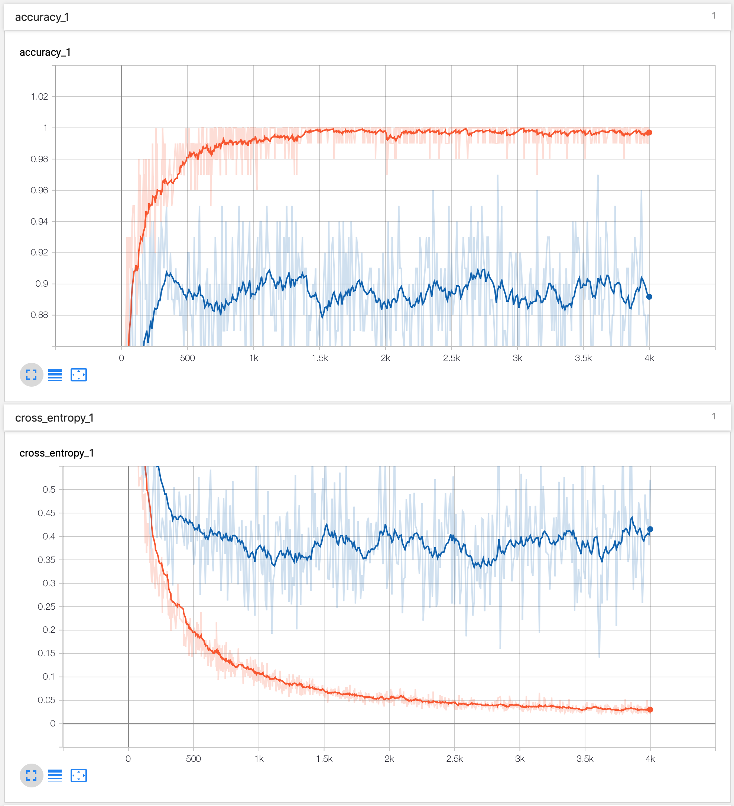
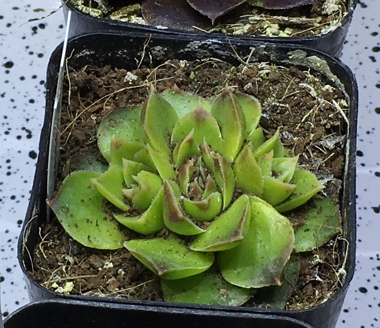
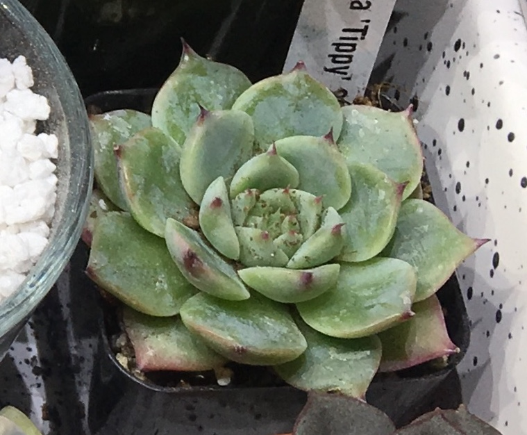
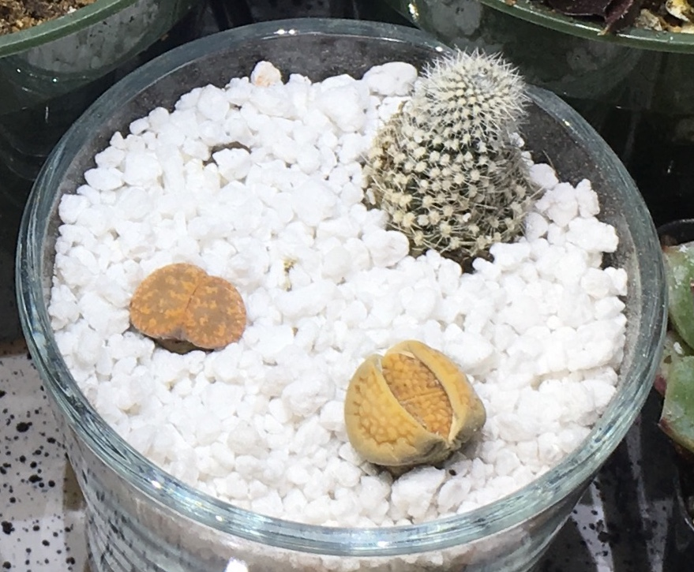

# Small-scale practice model

I tried to download 100 images of 5 plants for a small-scale experiment. I chose the following 5 plants: Frailea castanea, Haworthia pygmaea, Euphorbia obesa, Titanopsis calcarea, and Echeveria purpusorum. I chose these plants for two reasons: 1) I have unique images that I know are not online and therefore will not have been seen by the model before, and 2) these plants have distinct features that I think the model will be able to identify fairly easily.

## Training on practice cacti

The only thing I should need to change the pointer for the images. I copied the two python scripts, "retrain.p" and "label_image.py", into the main directory and retrained the top layer of the network using my own practice data set of 100 images of 5 different succulents. This time, I saved the model to the current directory.

```bash
python retrain.py \
    --image_dir ./downloads \
    --output_graph ./practice_output_graph.pb \
    --output_labels ./output_labels.txt \
    --print_misclassified_test_images
#> I0820 09:05:54.218355 140238499538752 graph_util_impl.py:311] Froze 378 variables.
#> I0820 09:05:54.374392 140238499538752 graph_util_impl.py:364] Converted 378 variables to const ops.
```

Here is a screenshot of the TensorBoard after the training was finished. It may be overfit...




## Testing on new images

I then tested the model on *new* images from my own photos collection stored in "my_plant_images/".

First with the following image of a Frailea castanea.


```bash
python label_image.py \
    --graph=./practice_output_graph.pb \
    --labels=./output_labels.txt \
    --input_layer=Placeholder \
    --output_layer=final_result \
    --image=./my_plant_images/Frailea\ castanea_2.JPG
#> frailea castanea 0.9845865
#> euphorbia obesa 0.00694018
#> haworthia pygmaea 0.004538389
#> titanopsis calcarea 0.003469223
#> echeveria purpusorum 0.00046558472
```

Success!

How about a Haworthia pygmaea?


```bash
python label_image.py \
    --graph=./practice_output_graph.pb \
    --labels=./output_labels.txt \
    --input_layer=Placeholder \
    --output_layer=final_result \
    --image=./my_plant_images/Haworthia\ pygmaea_2.jpg
#> haworthia pygmaea 0.96202874
#> euphorbia obesa 0.013198692
#> echeveria purpusorum 0.009985439
#> frailea castanea 0.00901769
#> titanopsis calcarea 0.0057695135
```

Yup!

A Euphorbia obesa?


```bash
python label_image.py \
    --graph=./practice_output_graph.pb \
    --labels=./output_labels.txt \
    --input_layer=Placeholder \
    --output_layer=final_result \
    --image=./my_plant_images/Euphorbia\ obesa_1.JPG
#> euphorbia obesa 0.40142217
#> frailea castanea 0.29709634
#> titanopsis calcarea 0.18816541
#> haworthia pygmaea 0.10937669
#> echeveria purpusorum 0.0039393585
```

Not as confident. May an image more zoomed in?


```bash
python label_image.py \
    --graph=./practice_output_graph.pb \
    --labels=./output_labels.txt \
    --input_layer=Placeholder \
    --output_layer=final_result \
    --image=./my_plant_images/Euphorbia\ obesa_3.JPG
#> euphorbia obesa 0.993863
#> titanopsis calcarea 0.0029714692
#> frailea castanea 0.0027843206
#> haworthia pygmaea 0.00036937947
#> echeveria purpusorum 1.1810706e-05
```

What about less familliar shapes? The two pictures below received scores of 0.97 and 0.67 for Euphorbia obesa, respectively. However, cropping the sceond image to just the obesa resulted in a score of 0.99 for Euphorbia obesa.


I ran the following two images of Titanopsis. The first was correctly identified, but the second scored the lowest for the correct category. 


```bash
python label_image.py \
    --graph=./practice_output_graph.pb \
    --labels=./output_labels.txt \
    --input_layer=Placeholder \
    --output_layer=final_result \
    --image=./my_plant_images/Titanopsis\ calcarea_1.JPG
#> titanopsis calcarea 0.7656298
#> frailea castanea 0.10117628
#> echeveria purpusorum 0.0850188
#> haworthia pygmaea 0.04713126
#> euphorbia obesa 0.0010438758

python label_image.py \
    --graph=./practice_output_graph.pb \
    --labels=./output_labels.txt \
    --input_layer=Placeholder \
    --output_layer=final_result \
    --image=./my_plant_images/Titanopsis\ calcarea_2.JPG
#> haworthia pygmaea 0.44177604
#> frailea castanea 0.2246552
#> echeveria purpusorum 0.13167255
#> euphorbia obesa 0.120860636
#> titanopsis calcarea 0.08103559
```

Zooming in on the misclassified photo boosted the score for Titanopsis to 0.99.


And finally, a Echeveria purpusorum.


```bash
python label_image.py \
    --graph=./practice_output_graph.pb \
    --labels=./output_labels.txt \
    --input_layer=Placeholder \
    --output_layer=final_result \
    --image=./my_plant_images/Echeveria\ purpusorum_2.jpg
#> echeveria purpusorum 0.97766393
#> haworthia pygmaea 0.017333306
#> titanopsis calcarea 0.0033603976
#> euphorbia obesa 0.0013941285
#> frailea castanea 0.00024822386
```

No problem.

Now, I have added in some "random" images. Let's see how the model does?

A variety of Sempervivum resulted in low confidence across the board. Unsurprisingly, the most confidence was given to the Echeveria.



```bash
python label_image.py \
    --graph=./practice_output_graph.pb \
    --labels=./output_labels.txt \
    --input_layer=Placeholder \
    --output_layer=final_result \
    --image=./my_plant_images/random_1.JPG
#> echeveria purpusorum 0.6112121
#> euphorbia obesa 0.22624858
#> haworthia pygmaea 0.095057175
#> titanopsis calcarea 0.046240527
#> frailea castanea 0.021241713
```
Another Echeveria produced similar results.



```bash
python label_image.py \
    --graph=./practice_output_graph.pb \
    --labels=./output_labels.txt \
    --input_layer=Placeholder \
    --output_layer=final_result \
    --image=./my_plant_images/random_2.jpg
#> echeveria purpusorum 0.6326179
#> haworthia pygmaea 0.18916579
#> euphorbia obesa 0.13849086
#> frailea castanea 0.031310003
#> titanopsis calcarea 0.008415436
```

A Graptosedum gets a high score for a Haworthia, perhaps because the shapes of the leaves are quite similar.


```bash
python label_image.py \
    --graph=./practice_output_graph.pb \
    --labels=./output_labels.txt \
    --input_layer=Placeholder \
    --output_layer=final_result \
    --image=./my_plant_images/random_3.jpg
#> haworthia pygmaea 0.8702831
#> echeveria purpusorum 0.08355066
#> euphorbia obesa 0.022053052
#> frailea castanea 0.015273594
#> titanopsis calcarea 0.008839603
```

Here is an (ugly) arrangement of a dying/dead cactus and two Lithops in poor shape. Encouragingly, the model does not give high confidence to any of the classes, but the highest is the Frailea which are small, circular, and often found in groups. If these Lithops were darker, I bet this percentage would increase.



```bash
python label_image.py \
    --graph=./practice_output_graph.pb \
    --labels=./output_labels.txt \
    --input_layer=Placeholder \
    --output_layer=final_result \
    --image=./my_plant_images/random_4.jpg
#> frailea castanea 0.46954283
#> titanopsis calcarea 0.27296653
#> euphorbia obesa 0.17989409
#> haworthia pygmaea 0.053318836
#> echeveria purpusorum 0.02427767
```

The last test: my kitchen table. It was not recognized as a plant. From this and the above random tests, I am quite encouraged that the model was not overfit.


```bash
python label_image.py \
    --graph=./practice_output_graph.pb \
    --labels=./output_labels.txt \
    --input_layer=Placeholder \
    --output_layer=final_result \
    --image=./my_plant_images/random_5.JPG
#> euphorbia obesa 0.51259345
#> frailea castanea 0.2750652
#> haworthia pygmaea 0.08634063
#> titanopsis calcarea 0.07448698
#> echeveria purpusorum 0.051513758
```

## Conclusion

As stated above, the plants I chose for practice were quite dissimilar in shape, texture, and color. It will be interesting to see how the model does with more possible categories and with plants that look more similar. For now, these are encouraging results and I look forward to scaling up the project.
